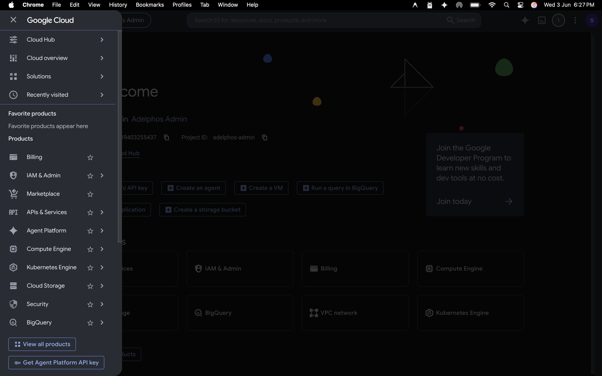

# Google API Setup for Adelphos Admin Panel

This guide walks you through connecting your admin dashboard to **Google Search Console** and **Google Analytics 4**.

---

## Step 1: Create a Google Cloud Project

1. Go to [Google Cloud Console](https://console.cloud.google.com/)
2. Click the project selector at the top → **New Project**
3. Name it `Adelphos Admin` (or anything you like)
4. Click **Create**

---



---

## Step 4: Upload the key to your server

Upload the downloaded JSON file to your VPS (e.g. via `scp` or SFTP):

```bash
scp adelphos-admin-*.json root@156.67.105.64:/var/www/adelphos_frontend/
```

Then update your server's `.env` file:

```bash
ssh root@156.67.105.64
nano /var/www/adelphos_frontend/.env
```

Add this line (use the actual filename):

```
GOOGLE_SERVICE_ACCOUNT_KEY=/var/www/adelphos_frontend/adelphos-admin-123456.json
```

Also add:

```
GA4_PROPERTY_ID=YOUR_GA4_PROPERTY_ID
```

> **How to find your GA4 Property ID:**
> Open [GA4](https://analytics.google.com/) → Admin (gear icon) → Property Settings → The ID is shown at the top right (e.g. `123456789`)

---

## Step 5: Share access with the Service Account

### For Search Console
1. Open [Google Search Console](https://search.google.com/search-console)
2. Select your property (`adelphostech.com`)
3. Click **Settings → Users and Permissions**
4. Click **Add User**
5. Paste the **service account email** (found in the JSON file under `client_email`, looks like `adelphos-admin@...iam.gserviceaccount.com`)
6. Set role to **Owner** or **Restricted Owner**
7. Click **Add**

### For GA4
1. Open [GA4](https://analytics.google.com/)
2. Click **Admin → Property Access Management**
3. Click **Add users**
4. Paste the same service account email
5. Set role to **Viewer** or **Analyst**
6. Click **Add**

---

## Step 6: Restart the server

```bash
pm2 restart adelphos-website
```

Wait ~2 minutes for permissions to propagate, then visit `https://adelphostech.com/admin` and refresh the dashboard.

---

## Troubleshooting

| Error | Fix |
|---|---|
| "Google credentials not configured" | `GOOGLE_SERVICE_ACCOUNT_KEY` path is wrong or file missing |
| "GA4_PROPERTY_ID not set" | Add the property ID to `.env` |
| "User does not have sufficient permissions" | Re-check Step 5 — the service account email must be added to **both** Search Console and GA4 |
| "Site is not verified" | Verify `adelphostech.com` in Search Console first |

---

## Security Note

- Keep the JSON key file safe. Anyone with it can read your Search Console and GA4 data.
- Do not commit the JSON key to Git.
- If the key is ever exposed, delete it in Google Cloud and create a new one.
